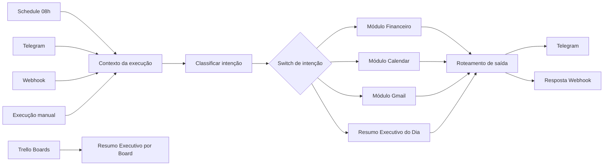

# Clara - Secretária Executiva Digital

Automação modular desenvolvida no **n8n** para apoiar a rotina executiva de Christian, centralizando consultas financeiras, agenda, e-mails e acompanhamento de atividades em boards do Trello.

A solução recebe comandos por Telegram, webhook, execução agendada ou execução manual, identifica a intenção do usuário, chama o módulo correspondente e devolve uma resposta executiva produzida com apoio da OpenAI.

> [!CAUTION]
> **Não publique os arquivos JSON atuais em um repositório público antes de remover e trocar todas as credenciais.**
>
> Os fluxos analisados possuem chaves, tokens, identificadores e endereços configurados diretamente em nodes. Isso inclui credenciais da OpenAI, Telegram e Trello. Considere essas credenciais comprometidas, revogue-as e gere novas credenciais antes de subir o projeto para o GitHub.

---

## Visão geral

A Clara funciona como uma camada de orquestração entre canais de entrada, serviços externos e módulos especializados.

Principais responsabilidades:

- receber comandos pelo Telegram, webhook, agendamento ou execução manual;
- identificar se o pedido é financeiro, agenda, e-mail ou resumo executivo diário;
- consultar as fontes necessárias;
- normalizar os dados;
- solicitar à OpenAI uma análise executiva;
- devolver a resposta pelo canal adequado;
- gerar resumos operacionais de boards do Trello.

---

## Arquitetura



---

## Fluxos incluídos

| Arquivo | Função | Situação identificada |
|---|---|---|
| `SEC - Secretaria Executiva Financeiro PJ - Final (2).json` | Orquestrador principal da Clara | Ativo |
| `SEC - CONTROLE FINANCEIRO.json` | Subfluxo de análise financeira | Inativo no arquivo exportado |
| `SEC - Clara - Modulo Calendar.json` | Subfluxo de agenda | Inativo no arquivo exportado |
| `SEC - Clara - Modulo Gmail(1).json` | Subfluxo de e-mails | Ativo |
| `Trello - Resumo Executivo por Boards (1).json` | Resumo operacional de boards | Inativo e independente do orquestrador |

Também existe uma chamada para o workflow:

```text
SEC - Clara - Resumo Executivo Dia
```

Esse subfluxo é referenciado pelo orquestrador, mas não está entre os arquivos analisados neste repositório.

---

## 1. Orquestrador principal

### Workflow

```text
SEC - Secretaria Executiva Financeiro PJ - Final
```

### Entradas

#### Agendamento

Execução automática de segunda a sexta-feira, às 08:00:

```cron
0 8 * * 1-5
```

O horário efetivo depende do timezone configurado no n8n.

Recomendação:

```text
America/Sao_Paulo
```

#### Telegram

O node `Telegram Trigger` recebe mensagens enviadas ao bot configurado.

#### Webhook

Endpoint configurado:

```text
POST /webhook/sec-secretaria-financeiro
```

Exemplo de corpo:

```json
{
  "mensagem": "Clara, como está minha agenda hoje?",
  "usuario": "Christian",
  "chat_id": "ID_DO_CHAT"
}
```

#### Execução manual

Pode ser utilizada no editor do n8n para testes técnicos.

---

## Classificação de intenção

O node `Code - Classificar Intencao Clara` normaliza a mensagem e classifica a solicitação.

### Intenções reconhecidas

| Intenção | Exemplos de termos |
|---|---|
| `financeiro` | financeiro, PJ, conta, pendência, pagamento, boleto, nota, receita, despesa |
| `calendario` | agenda, calendário, compromisso, reunião, evento, horário |
| `email` | e-mail, Gmail, caixa de entrada, não lido, importante |
| `resumo_executivo_dia` | resumo do dia, resumo executivo, me atualiza, como está meu dia |
| `ajuda` | oi, olá, ajuda, `/start` ou comando não reconhecido |

### Exemplos de comandos

```text
Clara, tenho pendências financeiras?
Clara, como está minha agenda hoje?
Clara, tenho e-mails importantes?
Clara, me dê o resumo executivo do dia.
```

---

## Roteamento para subfluxos

O node `Switch - Intencao Clara` direciona a execução para:

| Saída | Workflow chamado |
|---|---|
| `financeiro` | `SUB WF FINANCEIRO` |
| `resumo_executivo_dia` | `SEC - Clara - Resumo Executivo Dia` |
| `calendario` | `SEC - Clara - Modulo Calendar` |
| `email` | `SEC - Clara - Modulo Gmail` |

Os IDs internos dos workflows mudam entre instâncias do n8n. Após a importação, cada node `Execute Workflow` deve ser reconfigurado para apontar para o workflow correto da nova instância.

---

## 2. Módulo Financeiro

### Workflow

```text
SEC - CONTROLE FINANCEIRO
```

### Objetivo

Ler o planejamento financeiro e os status mensais de uma planilha Google Sheets, identificar pendências, vencimentos e ações necessárias e gerar um resumo executivo.

### Entrada

O módulo é iniciado pelo node:

```text
SAIDA FINANCEIRO
```

Apesar do nome, esse node é um `Execute Workflow Trigger` e representa a entrada do subworkflow.

### Fontes de dados

O módulo lê duas abas do mesmo documento:

```text
Controle Financeiro da empresa
Controle Financeiro Status
```

### Processamento

O node `Code - Analisar Financeiro`:

- identifica o mês e o ano atuais;
- converte valores monetários em formato brasileiro;
- cruza valores e status por número da linha ou descrição;
- ignora linhas de totais, saldos e indicadores agregados;
- aplica regras operacionais por tipo de despesa ou receita;
- calcula dias para vencimento;
- identifica itens pagos, recebidos, pendentes, em andamento ou sem regra;
- define prioridade e ação recomendada;
- sinaliza necessidade de boleto ou nota fiscal.

### Status interpretados

| Status normalizado | Tratamento |
|---|---|
| `pago` | concluído, sem alerta |
| `recebido` | concluído, sem alerta |
| `pendente` | gera alerta |
| `nao_recebido` | gera alerta |
| `em_andamento` | requer atenção |
| `atencao` | requer atenção |
| `sem_status` | requer análise |
| `status_nao_mapeado` | requer análise |

### Classificação de prazo

| Situação | Regra |
|---|---|
| `vencido` | data anterior ao dia atual |
| `vence_hoje` | vencimento no dia atual |
| `vence_em_ate_3_dias` | vencimento entre 1 e 3 dias |
| `vence_em_ate_7_dias` | vencimento entre 4 e 7 dias |
| `fora_da_janela` | vencimento superior a 7 dias |

### Saída padronizada

```json
{
  "status": "ok",
  "modulo": "financeiro",
  "origem_execucao": "telegram",
  "usuario": "Christian",
  "telegram_chat_id": "ID_DO_CHAT",
  "chat_id": "ID_DO_CHAT",
  "intencao": "financeiro",
  "mensagem": "Resumo produzido pela IA",
  "mensagem_telegram": "Resumo produzido pela IA",
  "resumo_executivo": "Resumo produzido pela IA",
  "resposta_webhook": {
    "status": "ok",
    "modulo": "financeiro",
    "mensagem": "Resumo produzido pela IA"
  },
  "dados_tecnicos": {
    "uso_tokens": null,
    "modelo": null,
    "data_processamento": "ISO-8601"
  }
}
```

---

## 3. Módulo Calendar

### Workflow

```text
SEC - Clara - Modulo Calendar
```

### Objetivo

Consultar compromissos do dia em duas contas Google Calendar e produzir uma análise executiva.

### Fontes

O fluxo consulta:

- calendário primário da conta 1;
- calendário configurado da conta 2.

### Processamento

O módulo:

1. consulta os eventos nas duas contas;
2. une os resultados;
3. normaliza título, início, fim, local, descrição, link, organizador e status;
4. envia os dados para análise da OpenAI;
5. solicita identificação de:
   - compromissos do dia;
   - conflitos de horário;
   - reuniões sem link;
   - reuniões sem pauta;
   - recomendações práticas.

### Saída esperada

```text
CHRISTIAN, sua agenda de hoje está assim:

Agenda:
- ...

Pontos de atenção:
- ...

Minha recomendação:
- ...
```

### Saída técnica

O contrato de saída segue a mesma estrutura do módulo financeiro, utilizando:

```json
{
  "status": "ok",
  "modulo": "calendario",
  "mensagem": "Resumo da agenda"
}
```

---

## 4. Módulo Gmail

### Workflow

```text
SEC - Clara - Modulo Gmail
```

### Objetivo

Consultar e-mails não lidos de duas contas Gmail, eliminar duplicidades e classificar o que precisa de ação.

### Consulta utilizada

```text
in:inbox is:unread newer_than:7d -category:promotions -category:social
```

Cada conta retorna no máximo 20 e-mails por execução.

### Processamento

O módulo:

- consulta duas contas Gmail;
- une os resultados;
- extrai assunto, remetente, destinatário, data, snippet, labels e anexos;
- elimina duplicidades por `threadId` ou combinação de assunto, remetente e destinatário;
- limita o snippet a 900 caracteres;
- envia os dados normalizados à OpenAI.

### Categorias produzidas

1. Prioridade alta
2. Responder
3. Resolver ou verificar
4. Informativo
5. Pode esperar
6. Ignorar ou arquivar

### Restrições do prompt

A IA é instruída a:

- utilizar somente os dados recebidos;
- não inventar conteúdo;
- explicar por que um e-mail merece atenção;
- agrupar mensagens repetidas;
- recomendar as próximas ações.

---

## 5. Resumo Executivo por Boards do Trello

### Workflow

```text
Trello - Resumo Executivo por Boards
```

### Objetivo

Consultar cards abertos de vários boards, considerando somente as listas:

```text
BACKLOG
TO DO
DOING
```

### Processamento

Para cada board configurado, o fluxo:

1. consulta as listas abertas;
2. seleciona as listas-alvo;
3. consulta os cards abertos;
4. normaliza informações dos cards;
5. agrupa os resultados por board e lista;
6. calcula:
   - total de cards;
   - cards com data;
   - cards sem data;
   - cards sem descrição;
7. gera um resumo textual com links para os cards.

### Saída

Cada item retornado representa um board:

```json
{
  "board_id": "ID_DO_BOARD",
  "board_name": "Nome do board",
  "total_cards": 0,
  "cards_sem_data": 0,
  "cards_com_data": 0,
  "cards_sem_descricao": 0,
  "listas": [],
  "resumo_executivo": "Resumo textual do board"
}
```

### Observação

Esse workflow não possui trigger no arquivo analisado. Para executá-lo, adicione uma das opções:

- `Schedule Trigger`;
- `Webhook`;
- `Execute Workflow Trigger`;
- `Manual Trigger`.

Caso ele deva fazer parte da Clara, a melhor opção é transformá-lo em subworkflow e adicionar uma intenção `trello` no orquestrador.

---

## Canais de saída

O node `Code - Roteamento Saida` decide o canal conforme a origem.

| Origem | Comportamento esperado |
|---|---|
| Telegram | envia mensagem ao Telegram |
| Schedule | envia resumo ao Telegram |
| Webhook | responde ao webhook |
| Manual | utilizado para teste no editor |

Estrutura normalizada:

```json
{
  "status": "ok",
  "usuario": "Christian",
  "origem_execucao": "telegram",
  "enviar_telegram": true,
  "responder_webhook": false,
  "telegram_chat_id": "ID_DO_CHAT",
  "chat_id": "ID_DO_CHAT",
  "mensagem": "Resposta final",
  "mensagem_telegram": "Resposta final",
  "resposta_webhook": {
    "status": "ok",
    "usuario": "Christian",
    "origem_execucao": "telegram",
    "mensagem": "Resposta final"
  }
}
```

---

## Tecnologias e integrações

- [n8n](https://n8n.io/)
- Google Sheets API
- Google Calendar API
- Gmail API
- Telegram Bot API
- Trello REST API
- OpenAI Chat Completions API
- JavaScript em nodes `Code`

Modelo configurado nos módulos analisados:

```text
gpt-4o-mini
```

Temperatura configurada:

```text
0.2
```

---

## Pré-requisitos

- instância n8n compatível com os nodes utilizados;
- credenciais OAuth2 do Google configuradas no n8n;
- bot do Telegram criado e configurado;
- credenciais da OpenAI;
- chave e token da API do Trello;
- acesso às planilhas, calendários, contas Gmail e boards utilizados;
- timezone correto na instância.

---

## Variáveis de ambiente recomendadas

Os arquivos analisados ainda possuem valores configurados diretamente nos nodes. A recomendação é usar variáveis de ambiente ou credenciais nativas do n8n.

```env
OPENAI_API_KEY=
TELEGRAM_BOT_TOKEN=
TELEGRAM_CHAT_ID=
TRELLO_API_KEY=
TRELLO_API_TOKEN=
FINANCEIRO_SHEET_ID=
GOOGLE_CALENDAR_SECONDARY_ID=
N8N_TIMEZONE=America/Sao_Paulo
GENERIC_TIMEZONE=America/Sao_Paulo
```

### Referência nos nodes

OpenAI:

```text
Bearer {{ $env.OPENAI_API_KEY }}
```

Telegram:

```text
https://api.telegram.org/bot{{ $env.TELEGRAM_BOT_TOKEN }}/sendMessage
```

Chat ID:

```text
{{ $json.telegram_chat_id || $env.TELEGRAM_CHAT_ID }}
```

Trello:

```javascript
const apiKey = $env.TRELLO_API_KEY;
const apiToken = $env.TRELLO_API_TOKEN;
```

> Em ambientes que bloqueiam acesso a `$env` nos nodes Code, utilize credenciais nativas, variables do n8n ou um mecanismo de secrets compatível com sua implantação.

---

## Credenciais necessárias no n8n

Configure as seguintes credenciais:

| Integração | Tipo de credencial |
|---|---|
| Google Sheets | Google Sheets OAuth2 API |
| Google Calendar conta 1 | Google Calendar OAuth2 API |
| Google Calendar conta 2 | Google Calendar OAuth2 API |
| Gmail conta 1 | Gmail OAuth2 |
| Gmail conta 2 | Gmail OAuth2 |
| Telegram Trigger | Telegram API |
| OpenAI | Header Auth ou credencial OpenAI |
| Trello | Header/query configurado com secrets |

Os IDs das credenciais exportados nos JSONs são locais à instância original e não serão automaticamente válidos em outra instalação.

---

## Instalação

### 1. Clonar o repositório

```bash
git clone URL_DO_REPOSITORIO
cd NOME_DO_REPOSITORIO
```

### 2. Importar os subfluxos

Importe primeiro:

1. `SEC - CONTROLE FINANCEIRO.json`
2. `SEC - Clara - Modulo Calendar.json`
3. `SEC - Clara - Modulo Gmail(1).json`
4. workflow de resumo executivo diário, quando disponível
5. `Trello - Resumo Executivo por Boards (1).json`

### 3. Importar o orquestrador

Importe por último:

```text
SEC - Secretaria Executiva Financeiro PJ - Final (2).json
```

### 4. Reconfigurar os nodes Execute Workflow

Selecione novamente os workflows chamados por:

- `Call 'SUB WF FINANCEIRO'`
- `Call 'SEC - Clara - Modulo Calendar'`
- `Call 'SEC - Clara - Modulo Gmail'`
- `Call 'SEC - Clara - Resumo Executivo Dia'`

### 5. Configurar credenciais

Associe todas as credenciais Google, Telegram, OpenAI e Trello.

### 6. Ajustar parâmetros

Revise:

- ID da planilha financeira;
- nomes das abas;
- calendários consultados;
- consultas do Gmail;
- boards e listas do Trello;
- chat ID do Telegram;
- timezone;
- horários dos agendamentos;
- regras e dias de vencimento financeiro.

### 7. Testar cada subfluxo

Execute cada módulo isoladamente antes de testar o orquestrador.

### 8. Ativar os workflows

Ative apenas depois da validação das credenciais e rotas.

---

## Testes recomendados

### Teste financeiro

```json
{
  "mensagem": "Clara, tenho contas pendentes?",
  "usuario": "Christian"
}
```

Validar:

- leitura das duas abas;
- cruzamento de valores e status;
- cálculo dos vencimentos;
- geração do resumo;
- saída com `modulo: financeiro`.

### Teste de agenda

```json
{
  "mensagem": "Clara, como está minha agenda hoje?",
  "usuario": "Christian"
}
```

Validar:

- consulta das duas contas;
- ausência de eventos duplicados;
- timezone;
- identificação de conflitos;
- links de reunião.

### Teste de e-mail

```json
{
  "mensagem": "Clara, tenho e-mails importantes?",
  "usuario": "Christian"
}
```

Validar:

- consulta das duas contas;
- filtro de não lidos;
- deduplicação;
- classificação;
- ausência de informações inventadas.

### Teste do resumo do dia

```json
{
  "mensagem": "Clara, me dê o resumo executivo do dia.",
  "usuario": "Christian"
}
```

Esse teste depende do workflow `SEC - Clara - Resumo Executivo Dia`, que não está incluído nos arquivos analisados.

### Teste do Trello

Executar manualmente após adicionar um trigger e validar:

- boards acessíveis;
- listas `BACKLOG`, `TO DO` e `DOING`;
- totalização correta;
- cards sem data;
- cards sem descrição;
- links dos cards.

---

## Pontos de atenção identificados

### 1. Segredos expostos

Foram encontrados valores sensíveis diretamente nos arquivos exportados.

Ações obrigatórias antes do GitHub:

1. revogar e recriar a chave da OpenAI;
2. revogar e recriar o token do bot Telegram;
3. revogar e recriar o token do Trello;
4. remover os valores dos JSONs;
5. migrar as configurações para credentials, variables ou secrets;
6. verificar o histórico do Git caso algum arquivo já tenha sido commitado.

Somente apagar o segredo do commit mais recente não é suficiente. Ele continuará disponível no histórico.

### 2. Workflow de resumo diário ausente

O orquestrador chama:

```text
SEC - Clara - Resumo Executivo Dia
```

O arquivo correspondente precisa ser incluído ou a rota deve ser temporariamente desativada.

### 3. Saída de ajuda

O `Switch - Intencao Clara` possui uma regra de ajuda com valor aparentemente configurado como:

```text
=ajuda
```

Além disso, a exportação mostra conexões somente para as quatro primeiras saídas. A resposta de ajuda pode não chegar ao node de roteamento.

Correção recomendada:

- alterar o valor para `ajuda`;
- conectar a saída `ajuda` diretamente ao `Code - Roteamento Saida`;
- ou ignorar o Switch quando `resposta_direta` estiver preenchida.

### 4. Execução manual e Respond to Webhook

No orquestrador principal, a execução manual é marcada para responder pelo caminho do webhook. Um node `Respond to Webhook` sem contexto de webhook pode falhar.

Correção recomendada:

```javascript
const responderWebhook = origemNormalizada === 'webhook';
```

Para execução manual, encerre no próprio workflow ou use uma saída separada.

### 5. Janela de consulta dos calendários

As duas contas usam janelas diferentes:

- conta 1: início e fim do dia;
- conta 2: momento atual até mais um dia.

Isso pode gerar resultados inconsistentes.

Padronização recomendada:

```javascript
timeMin = $now.startOf('day').toISO()
timeMax = $now.endOf('day').toISO()
```

### 6. Timezone

A lógica financeira e de agenda depende da data atual. Um timezone incorreto pode alterar:

- mês analisado;
- cálculo de vencimentos;
- eventos do dia;
- horário do schedule.

Configure:

```env
N8N_TIMEZONE=America/Sao_Paulo
GENERIC_TIMEZONE=America/Sao_Paulo
```

### 7. IDs fixos

Foram encontrados IDs específicos de:

- planilha;
- calendários;
- workflows;
- boards;
- chat Telegram;
- credenciais internas do n8n.

Esses valores devem ser tratados como configuração de ambiente e revisados em cada implantação.

### 8. Trello sem trigger

O fluxo do Trello não possui entrada de execução no arquivo atual. Ele não executará automaticamente até receber um trigger.

### 9. Tratamento de falhas

Os fluxos utilizam exceções em nodes Code, mas não apresentam uma rota global de erro.

Recomendações:

- configurar `Error Workflow` no n8n;
- registrar módulo, node, horário e mensagem do erro;
- enviar alerta técnico pelo Telegram;
- evitar enviar dados financeiros ou conteúdo de e-mails nos logs de erro.

### 10. API da OpenAI via HTTP

Os módulos chamam diretamente:

```text
POST https://api.openai.com/v1/chat/completions
```

Isso funciona, mas é recomendável centralizar:

- autenticação;
- modelo;
- timeout;
- política de retry;
- captura de erro;
- contabilização de tokens.

Também pode ser utilizado o node oficial da OpenAI, desde que o contrato de saída seja mantido.

---

## Segurança e privacidade

Os módulos processam informações financeiras, compromissos e conteúdo de e-mails.

Recomendações mínimas:

- manter o repositório privado;
- nunca versionar credenciais;
- aplicar princípio do menor privilégio nas contas Google;
- limitar o bot Telegram aos usuários autorizados;
- proteger o webhook com autenticação;
- evitar exposição de conteúdo sensível em logs;
- definir política de retenção de execuções do n8n;
- revisar quais dados são enviados à OpenAI;
- documentar consentimento e finalidade do tratamento;
- manter backup criptografado da instância e das credenciais.

### Proteção do webhook

O webhook atual deve receber algum mecanismo de autenticação, por exemplo:

- Header Authentication;
- token secreto em header;
- API Gateway;
- proxy reverso com autenticação;
- allowlist de IP, quando aplicável.

Exemplo conceitual:

```http
Authorization: Bearer TOKEN_INTERNO
Content-Type: application/json
```

---

## Estrutura sugerida do repositório

```text
.
├── README.md
├── workflows
│   ├── main
│   │   └── sec-clara-orquestrador.json
│   ├── modules
│   │   ├── sec-clara-financeiro.json
│   │   ├── sec-clara-calendar.json
│   │   ├── sec-clara-gmail.json
│   │   ├── sec-clara-resumo-dia.json
│   │   └── trello-resumo-boards.json
│   └── sanitized
├── docs
│   ├── architecture.md
│   ├── configuration.md
│   ├── testing.md
│   └── security.md
├── examples
│   ├── webhook-financeiro.json
│   ├── webhook-calendario.json
│   └── webhook-email.json
├── .env.example
└── .gitignore
```

---

## `.gitignore` recomendado

```gitignore
.env
.env.*
!.env.example

*.log
logs/
backups/

.n8n/
credentials/
secrets/

workflows/raw/
workflows/private/
```

O `.gitignore` não remove arquivos que já foram adicionados ao histórico do Git.

---

## Melhorias futuras

- incluir o Trello como módulo da Clara;
- criar o módulo consolidado de resumo do dia;
- substituir classificação baseada apenas em palavras por saída estruturada;
- criar autenticação e autorização por usuário;
- armazenar configurações por ambiente;
- centralizar chamadas à OpenAI;
- adicionar timeout, retry e circuit breaker;
- criar auditoria de execuções;
- adicionar monitoramento de custo e tokens;
- implementar testes automatizados dos nodes Code;
- padronizar todos os contratos de entrada e saída;
- adicionar alertas de erro;
- separar ambientes de desenvolvimento, homologação e produção.

---

## Roadmap sugerido

### Fase 1 - Segurança

- rotacionar credenciais;
- sanitizar os JSONs;
- proteger o webhook;
- retirar IDs e tokens fixos;
- configurar timezone.

### Fase 2 - Estabilidade

- corrigir rota de ajuda;
- corrigir execução manual;
- padronizar janelas de calendário;
- criar tratamento global de erros;
- validar subworkflow de resumo diário.

### Fase 3 - Evolução

- integrar Trello ao orquestrador;
- consolidar resumo financeiro, agenda, e-mails e tarefas;
- criar histórico e indicadores;
- adicionar comandos de ação, não apenas consulta;
- implementar controle de acesso por usuário.

---

## Status atual

| Componente | Leitura | IA | Retorno padronizado | Integrado ao orquestrador |
|---|---:|---:|---:|---:|
| Financeiro | Sim | Sim | Sim | Sim |
| Calendar | Sim | Sim | Sim | Sim |
| Gmail | Sim | Sim | Sim | Sim |
| Resumo do dia | Não analisado | Não analisado | Não analisado | Referenciado |
| Trello | Sim | Não | Parcial | Não |

---

## Licença

Defina a licença conforme o uso do projeto.

Para projeto privado:

```text
Copyright © Consult Services Tecnologia.
Uso interno. Todos os direitos reservados.
```

Para distribuição aberta, avalie MIT, Apache-2.0 ou outra licença compatível com a finalidade do projeto.

---

## Responsável

**Christian**  
Consult Services Tecnologia

Projeto de automação e apoio executivo desenvolvido sobre n8n, APIs Google, Telegram, Trello e OpenAI.
